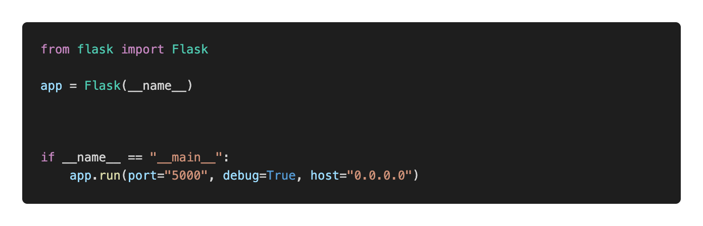

# 빠르게 Flask 시작하기

Flask의 자세한 설명은 교과서 첫페이지를 참고해주세요!

## Flask 라이브러리 설치하기

1. Flask 라이브러리를 설치해주세요! pip를 통해서 설치할 수 있습니다.

```bash
pip install flask
```

### Flask 첫 파일 생성하기

새로운 폴더 하나에 [application.py](http://application.py) 파일을 만들고, 아래와 같은 코드를 작성해주세요.



우선 우리가 만드는 웹의 Flask객체를 불러와 `app`이라는 변수에 담아줍니다.

`if __name__ == "__main__":`의 경우, python파일을 모듈이 아닌, 직접 호출시에만 실행하라는 코드입니다.

그 아래, `app`을 `run`을 통해서 실행합니다. 실행시 여러 조건은 파라미터로 주어집니다.

위의 코드는 `port`를 5000번, `debug`모드는 `True`, `host`는 `0.0.0.0`으로 설정하라는 의미입니다. 

### `Port`가 무엇인가요?

`port`는 쉽게 말하면 문(door)과 같습니다.

웹사이트 역시 서버라는 큰 컴퓨터에서 파이선을 실행하고, 유저가 그곳으로 접속하도록 하여 만들어집니다.

그 컴퓨터로 아무나 들어갈 수 없기 때문에, 특정 `port`라는 문을 열어두고, 그곳으로 접속하여

Flask로 만든 웹사이트를 볼 수 있도록 하는 것입니다.

### `Debug`모드가 무엇인가요?

디버그 모드는 쉽게 말하면, 파일을 수정하고 바로바로 볼 수 있도록 하는 모드를 의미합니다.

- **디버그 모드가 켜져있을 경우**
    
    파이썬 파일을 수정하여 저장하면 새로 Flask가 로드됩니다.
    또한, HTML파일을 수정하면 자동으로 반영이 됩니다.
    쉽게쉽게 바꿀 수 있기 때문에 실제 배포시에는 사용하시면 안됩니다.
    
- **디버그 모드가 꺼져있을 경우 (False)**
    
    파이썬 파일을 수정해도 웹사이트에 반영되지 않습니다.
    HTML을 수정해도 반영이되지 않습니다.
    실제 배포시에 조금 수정을 가하여도 이를 반영하도록 명령을 주기 전에는 바뀌지 않습니다.