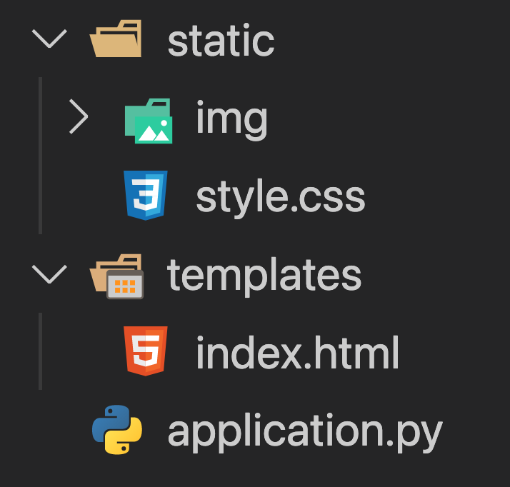

# Flask 기본구조 세팅하기

## Flask 설계하기

다음은 Flask의 기본구조입니다.

이전 장에서 만든 application.py가 있는 폴더에 static과 templates를 만들어줍니다. 그리고 static아래에 img폴더를 만들어줍니다. 이로써 기본적인 구조는 설계가 완료되었습니다.

### templates 폴더

이 폴더에는 HTML파일이 담기게 됩니다. HTML은 실제 웹페이지에 들어갈 내용을 담고 있는 파일입니다. 
templates 폴더 아래에 있는 HTML파일만 Flask를 통해서 보여줄 수 있습니다. 만들어질 모든 HTML파일은 이곳에 들어가게 됩니다.

### static 폴더

static폴더에는 동영상, 이미지 등 HTML위에서 보여지는 파일이 들어가거나, HTML을 이쁘게 꾸밀 수 있는 CSS를 담아두는 곳입니다. Img 폴더를 따로 만들어준 이유는 style.css와 이미지 파일들을 구분해주기 위해서 입니다.