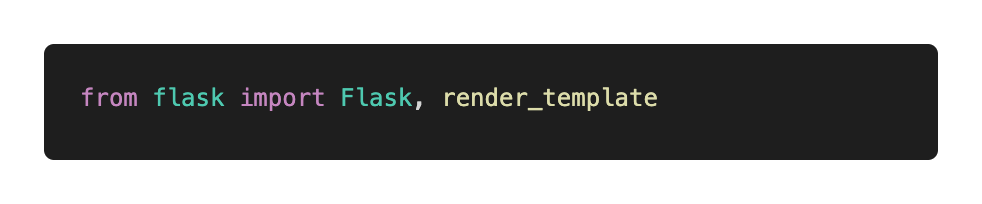
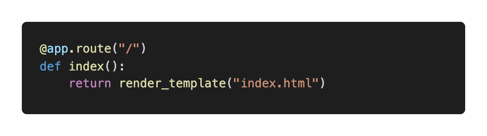
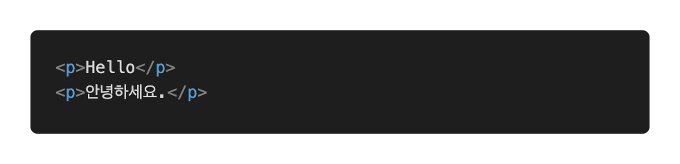

# Render Templates

Template을 랜더링한다는 것은 HTML파일을 유저에게 보내는 것을 의미합니다. templates 폴더에 있는 HTML을 Flask가 처리합니다. 이 HTML은 일반적인 HTML과는 조금 다른 Flask만의 특별한 형식을 띕니다. 뒤에 있는 "Flask HTML"부분에서 확인해보세요.

이번에는 Flask라이브러리에 함수 중 하나인 `render_template`을 사용해볼 예정입니다.

### 코드 예시 1 - 일반적인 랜더링

이전 장에서 나온 예시와 동일하게 세팅을 해놓으시면 됩니다.

그리고 `application.py` 파일에 `import` 부분에 `render_template`를 추가해줍니다.

이제 `index`함수에 아무 `str` 대신 `render_template`과 그 안에 파라미터로 `index.html`을 넣어줍니다. 

`render_template`안에 있는 `html파일명`의 경우, templates 폴더 내에 있는 html을 적어주면 됩니다. 그러면 해당 html이 URL에 접속할 때 보여지게 됩니다.

index.html에 아래와 같은 임의의 내용을 적어줍니다.

그리고 이전장에서 실행한 것과 같이 실행해보면, HTML에 적은 내용이 보여지는 것을 확인해볼 수 있습니다.

### 코드 예시 2 - 인자를 주기

HTML로 파이썬의 변수를 보낼 수도 있습니다. 더 많은 내용이나 복잡한 Flask HTML의 경우, 뒷장을 참고하시면 됩니다. 지금은 간단한 보내기 방법만 알아봅시다.

우선 아래와 같이 var이라는 변수를 하나 만들어줍니다. 그리고 그 안에 임의의 문자열을 담아보았습니다.

그리고 위의 코드처럼 `test_var` 이라는 이름으로 `var`를 내보내주었습니다. `test_var`는 HTML에서 사용하게 될 변수명이고, `var`의 경우 파이썬에서 사용하던 변수명입니다. `test_var`이나 `var`의 경우 아무 변수명이나 사용하실 수 있습니다.

그리고 index.html에 임의로 작성한 코드를 지우고 아래와 같은 코드를 작성해줍니다.

보시게 되면, 아무런 기호없이 작성한 부분은 일반적으로 보여지게 될 것입니다. `{{  }}` 안에 적은 `test_var` 부분은 파이썬에서 넘겨준 변수로 대체될 것입니다. 다시 실행해보면

`내가 할말: This is Testing`

이 HTML로 보여지는 것을 확인할 수 있습니다.

즉, `{{ }}` 안에 변수를 넣게 되면, 그 변수가 대신 보여지고, 그 안에 들어갈 변수명은 파이썬에 `render_template`함수의 파라미터의 앞부분으로 설정해주면 됩니다. 

기초적인 render_templates을 활용하여 HTML과 파이썬을 연동하는 방법에 대해서 알아보았습니다. 더 심화적인 HTML의 내용은 뒷장을 참고해주세요!