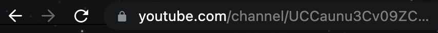
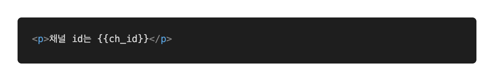
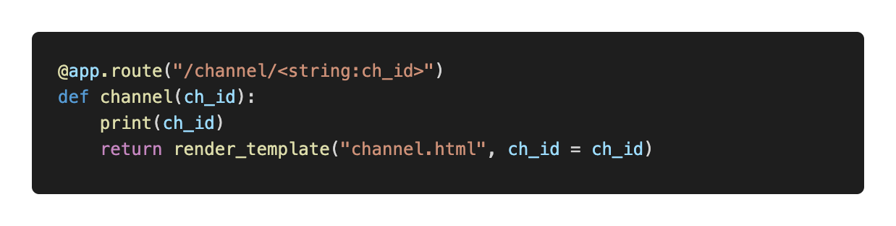

# Parameterize

다음은 파라미터라이징입니다. 아래는 유튜브에서 제 채널을 들어가면 나오는 링크입니다. 이것을 분석해보면 유튜브의 메인 링크인 `youtube.com` 이 있고, 이전에 route에서 설명드린 `channel`이란 곳으로 들어간 것을 확인해볼 수 있습니다. 그리고 그 위에는 유저에 해당하는 ID가 엄청 길게 붙어있는 것을 확인해볼 수 있습니다. 

유튜브의 채널을 생각해보면, 그 틀은 거의 비슷하고 안에 내용만 달라지게 됩니다. 이런 경우 유저마다 routes를 해서 각기 다른 유저 정보를 보여주는 것이 아니라, HTML틀은 똑같고 내부 정보만 다르게 하면 될 것 같다는 생각을 하게 됩니다.

## Code Example1

위의 예시를 비슷하게 한번 만들어보도록 하겠습니다. 먼저 channel.html을 생성해줍니다. 그리고 그 안에 아래와 같은 내용을 적어줍니다.

다음은 다시 파이썬으로 돌아와서 아래와 같은 코드를 작성합니다.

우선 `route`부분에서 `channel`은 처음 붙는 url입니다. 그리고 `< >` 안에는 가변 URL들어가게 됩니다. 가변 URL은 변할 수 있는 URL을 의미합니다. `< >` 안에는 두가지 내용을 채워주어야 합니다. 먼저 url에서 받게될 type을 적어주어야 합니다. 저는 문자열을 가정했음으로 `string`을 적어주었습니다. 그리고 `:` 뒤에는 파이썬에서 쓰게 될 변수명을 담아줍니다. 이렇게 되면 route시에 가변url이 `ch_id`라는 변수명으로 파이썬에 받아올 수 있게 됩니다.

다음은 함수안에 인자로 `ch_id`를 줍니다. 그러면 함수 내에서 `ch_id`를 받아올 수 있게 됩니다. 실제로 코딩할 때에는 print 부분에 데이터베이스에서 유저를 조회하는 등의 기능을 넣어서 활용할 수 있습니다.

나머지 부분은 이전 장에서 설명드렸으니 이해하실 수 있으실 겁니다.

실행 후 `0.0.0.0:5000/channel/flask_testing`를 통해 접속해보면 flask_testing이 나오게 됩니다. URL내의 flask_testing을 다른 것으로 바꾸면 웹페이지도 변경되는 것을 확인해볼 수 있습니다. 이를 통해 많은 양의 비슷한 웹페이지를 손쉽게 만들 수 있습니다.