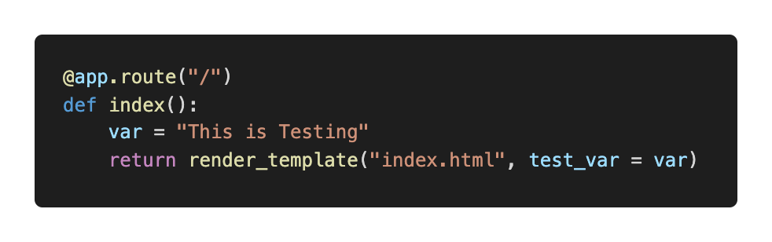
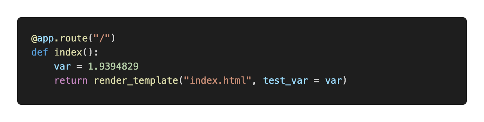
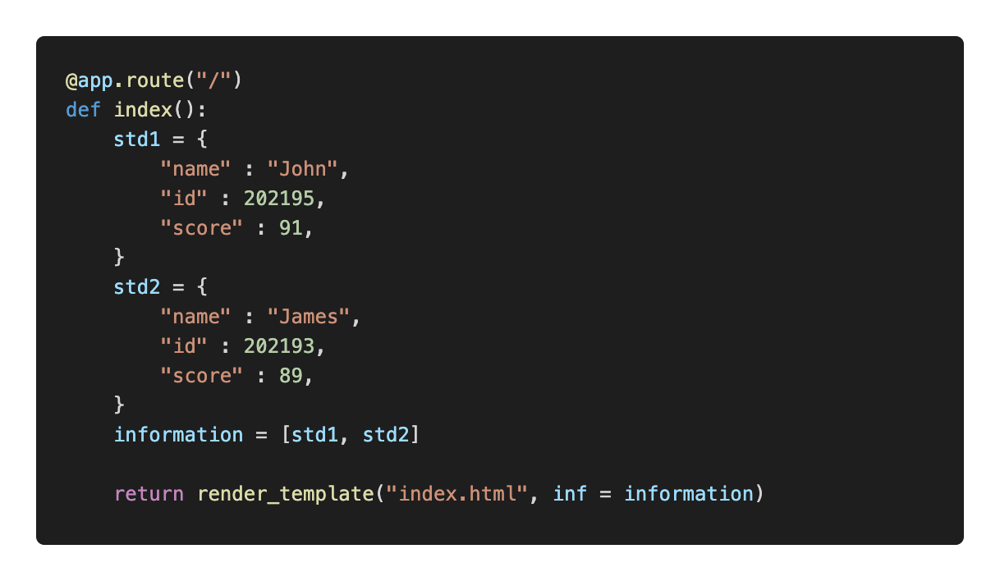
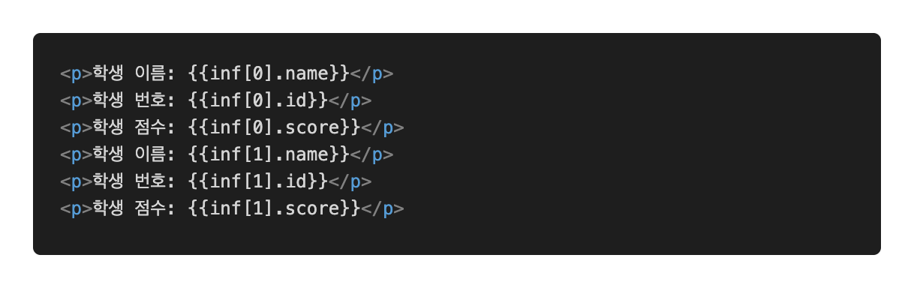
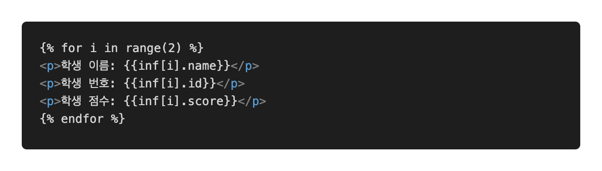
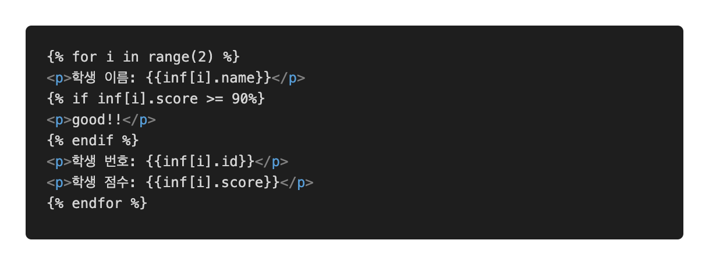

# Flask HTML

Flask는 Jinja라는 엔진으로 HTML을 보내고 응답을 받기 때문에, 특별한 HTML 양식이 있습니다.

## 1. 변수처리

우선 파이썬에서 변수에 특정 값 (str, int, float) 등을 담는다. 그리고 그것을 `render_templates`를 통해 넘겨준다. (render_templates 부분 참고)

HTML에서 해당 변수를 `{{ }}` 를 통해서 받아준다. 

var라는 변수에 임의의 값을 넣어주고, 이를 HTML에서 `{{ }}`안에 적어주면 원하는 값이 나오게 된다.

### 소수점 절사, 형태바꾸기

다음과 같은 방법을 사용하여 소수점 처리하거나 변수타입을 바꿀 수 있다.

var에 담은 내용을 다음과 같은 형태의 데이터로 변경하고 페이지에 접속하면 `1.939...` 하고 값이 길게 나오게 된다. 이것을 소수점 두번째 자리에서 반올림 하고 싶은 경우, HTML을 아래와 같이 수정한다.

이렇게 되면 소수점 두번째 자리까지만 나오게 만들 수 있게 된다.

### 여러개의 변수 깔끔하게 처리하기

파이썬 자료형인 dictionary를 통해서 여러개의 변수를 쉽게 처리할 수 있다.

이렇게 여러개의 변수를 넣고 HTML에 적는다고 생각해보자. 코드가 너무 길어지고 복잡해진다. 이것을 아래와 같이 수정하면 좋다.

1. 흐름처리
    
    if, for 를 HTML자체에서 활용할 수도 있다. 그것을 위해선 ``안에 흐름문을 넣어주면 된다.
    
    1.  for 문
    
    위에서 사용한 HTML을 보면, 동일하지만 인덱스 번호만 다른 값이 반복되고 있다. 지금은 2개이지만 이것이 엄청 많아질 경우 하나하나 코딩을 할 수는 없다.
    
    
    
    위처럼 `for`를 쓸 수 있다. `enumerate`나 `zip` 같은 것은 사용해줄 수 없고, `list` 인덱싱과 `range`함수만 사용할 수 있다.
    
    그리고 구분을 위해 for가 끝나는 곳에는 `` 를 붙여주어야 한다.
    
    2. if 문
    
    만약 90점이 넘는 학생에 good을 붙여주고 싶다고 가정해보자. 그러면 다음과 같은 방법으로 쉽게 할 수 있다.
    
    
    
    python과 동일하게 `if`문을 작성할 수 있고, `else`, `elif` 등도 사용가능하다. 동일하게 끝에 ``를 붙여주어야 한다.