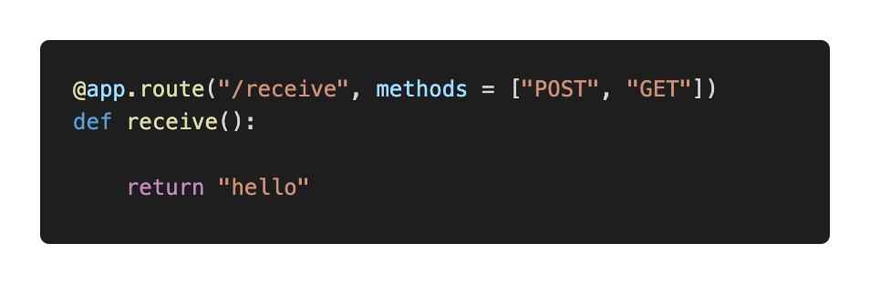
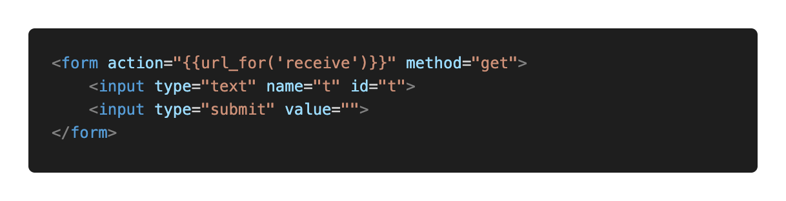
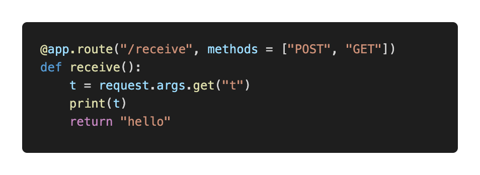

# Request

HTML에서 입력한 정보를 python으로 받아오는 방법도 존재한다. form을 사용해주어야 한다.

먼저 python파일에 입력을 받고 싶은 함수를 다음과 같이 생성한다.



기존과 동일하게 만들어주는데, methods에 POST와 GET을 동일하게 넣어준다. 정보를 받아오는 방식으로 POST와 GET을 써주겠다는 것인데, 뒷장에서 다시 설명하도록 하겠다.

index.html을 다시 사용해보겠다. index.html의 모든 내용을 지우고 다음과 같은 내용을 넣어준다.



그러면 text와 제출을 할 수 있는 버튼이 생성될 것이다. form을 통해 입력을 할 수 있고, text말고도 이미지, 선택버튼 등 다양한 것을 form을 통해 입력을 받을 수 있다. 여기서 살펴볼 것은 action에 url_for로 이것을 받아서 이동할 링크를 걸어주어야 한다는 것이다. method에도 post를 작성할 수 있는데, 자세한 내용은 뒷장에서 다루도록 한다.

다음은 코드 상단에

```python
from flask import Flask, render_template, request
```

처럼 request를 추가해 준다. 그후 아래와 같이 코드를 작성해준다.



request.args.get 객체를 통해서 입력을 받아오게 된다. 그리고 get안에는 html에서 id에 담은 식별자를 넣어주면 된다. 우리는 id="t"로 했기 때문에 위에처럼 코딩을 하면 된다. 

실제로 웹페이지에 접속해서 아무거나 입력을 해보면 콘솔창에 입력받은 값이 나오는 것을 확인해볼 수 있다.